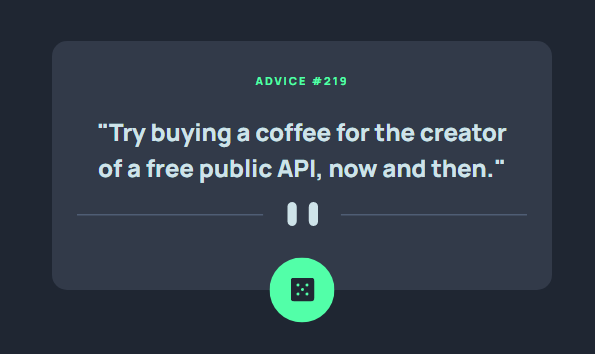

# Frontend Mentor - Advice generator app solution

Hello! 👋

This is a solution to the [Advice generator app challenge on Frontend Mentor](https://www.frontendmentor.io/challenges/advice-generator-app-QdUG-13db). Frontend Mentor challenges help you improve your coding skills by building realistic projects.

## Table of contents

- [Overview](#overview)
  - [The challenge](#the-challenge)
  - [Screenshot](#screenshot)
  - [Links](#links)
- [My process](#my-process)
  - [Built with](#built-with)
  - [Continued development](#continued-development)
- [Author](#author)

## Overview

### The challenge

Users should be able to:

- View the optimal layout for the app depending on their device's screen size ✔️
- See hover states for all interactive elements on the page ✔️
- Generate a new piece of advice by clicking the dice icon ✔️

### Screenshot

### Links

- Solution URL: [GitHub](https://github.com/jhellard/advice)
- Live Site URL: [Netlify](https://fancy-speculoos-ebde31.netlify.app/)

## My process

### Built with

- Semantic HTML5 markup
- SCSS w/ Grid
- Mobile-first workflow
- [React](https://reactjs.org/) - JS library
- [Sass](https://sass-lang.com/) - Main styling

### Continued development

This project is complete, I don't forsee any continued development.

## Author

- Website - [Joshua Hellard](https://www.jhellard.com)
- Frontend Mentor - [@jhellard](https://www.frontendmentor.io/profile/jhellard)
